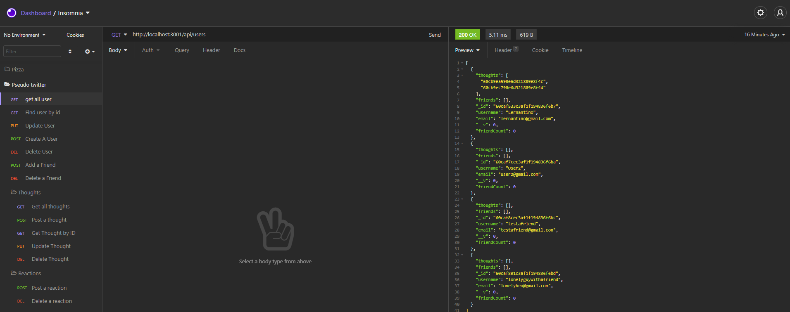

# Pseudo Twitter Backend

## Description

A backend database that handles API requests to manage a social network. Capabilities of the application include functionality for users, thoughts, and reactions. This includes being able to get all users, get all users by id, add users, edit users, and delete users. Additionally friends (other users) can be added and removed from users. Functionality for thoughts include being getting all thoughts, getting thoughts by id, adding thoughts, editing thoughts, and deleting thoughts. Functionality for reactions include adding a reaction to a thought and removing a reaction.
## Table of Contents
* [Video Walkthrough for Installation and Usage](#video-walkthrough-for-installation-and-usage)
* [Usage](#usage)
* [License](#license)
* [Questions](#questions)

## Video Walkthrough for Installation and Usage
https://drive.google.com/file/d/1zwkC4-rFrtVn5TAyy9OlRQ0kpFHEluqO/view?usp=sharing
## Usage
Use the command 'npm run start' in the command line in the root directory

## License
This project is covered under the MIT license.
[Click here to see the terms of the license](https://choosealicense.com/licenses/mit/)
## Questions
Any questions or concerns?
Contact me on my github: [blazelim](https://github.com/blazelim/)

Or email me at: blazebentleycolim@gmail.com